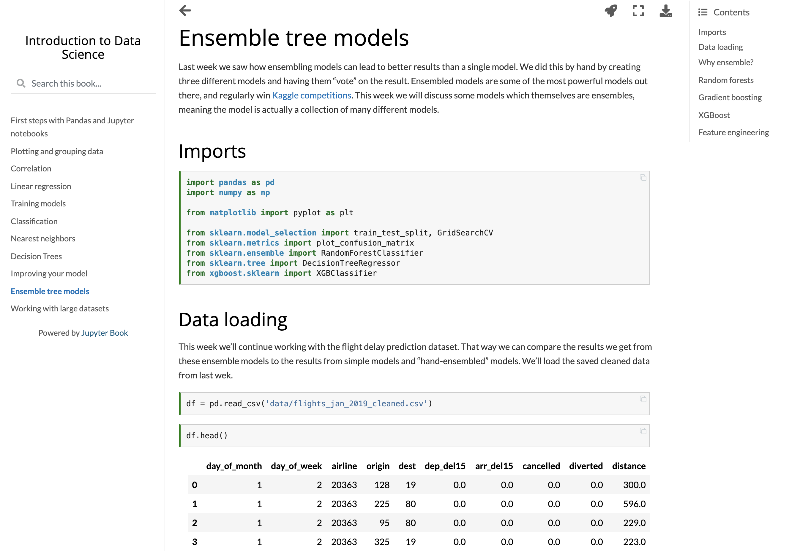

# Introduction to Data Science

These are materials for an introductory course in data science using Python, Pandas and Scikit-learn. Materials include a textbook written completely in Jupyter notebook (and also hosted as a Jupyter Book).

[Explore the textbook online](https://paulsavala.github.io/Introduction-to-Data-Science/ch_01.html)

## Textbook

The [textbook](https://github.com/paulsavala/Introduction-to-Data-Science/tree/main/textbook) is written entirely in Jupyter notebooks. This allows students to download the notebook and work with everything interactively. The textbook has the following chapters:
1. First steps with Pandas and Jupyter notebooks
2. Plotting and grouping data
3. Correlation
4. Linear regression
5. Training models
6. Classification
7. Nearest neighbors
8. Decision Trees
9. Improving your model
10. Ensemble tree models
11. Working with large datasets

The textbook is open source and you are free to modify it as needed. If you find errors or have suggestions or changes or improvements, please contact me at psavala@stedwards.edu.

### Building the textbook

If you would like to build the textbook so that it is viewable in a browser (such as [here](https://paulsavala.github.io/Introduction-to-Data-Science/ch_01.html)) you can do so using the Python package [Jupyter Book](https://jupyterbook.org/intro.html). To do so, first clone this repository. Then install Jupyter book using `pip install jupyter-book`. Next, navigate to where you cloned from this repository to (likely a folder named `Introduction-to-Data-Science` and type `jupyter-book build textbook/`. Then, follow the instructions shown by Jupyter Book.

## Projects

Four [projects](https://github.com/paulsavala/Introduction-to-Data-Science/tree/main/projects) are laid out, which take students from basic exploratory data analysis, up to building advanced models using multi-gigabyte data sets. These projects are designed to each take approximately three weeks. They culminate with a presentation, a Jupyter notebook showing all work, and an article appropriate for a general audience. In my course I require students to post their article on their LinkedIn page in order to appeal to potential future employers.

## Skills challenges

[Skills challenges](https://github.com/paulsavala/Introduction-to-Data-Science/tree/main/skills_challenge) are weekly labs where students are given a dataset and a number of questions/tasks to handle. They must complete these on their own, but are welcome to use any external resources they wish. These skills challenges enforce the idea of needing to be able to quickly accomplish routine tasks.

## Contact me

If you have questions, comments or feedback, please contact me at psavala@stedwards.edu. You can also connect with me on [LinkedIn](https://www.linkedin.com/in/paul-savala-ph-d-61153193/).
